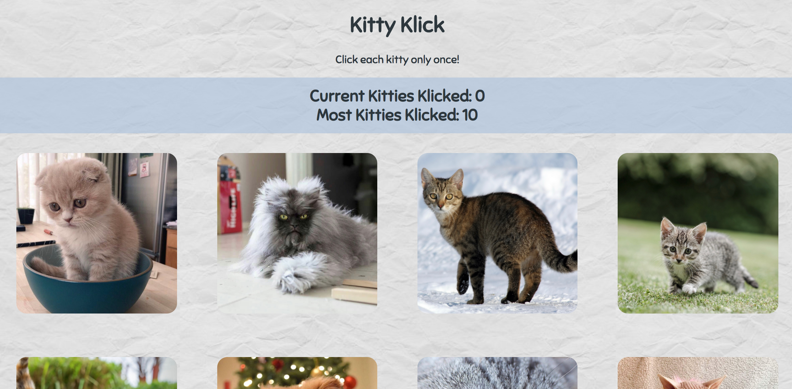

# Kitty Klick

Kitty Klick is a React app in which users click cat pictures to increment their score. On each click, the cat pictures randomly rearrange. If the same picture is clicked twice, the score resets to zero. A high score for the current user's visit is also displayed.

